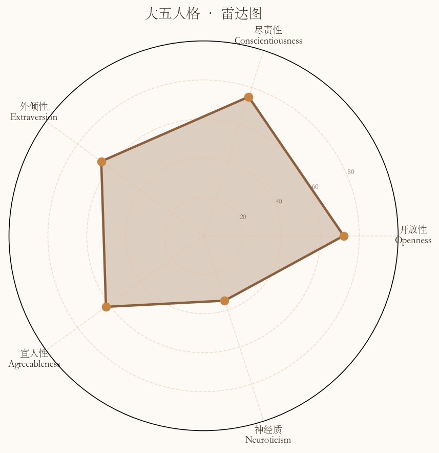
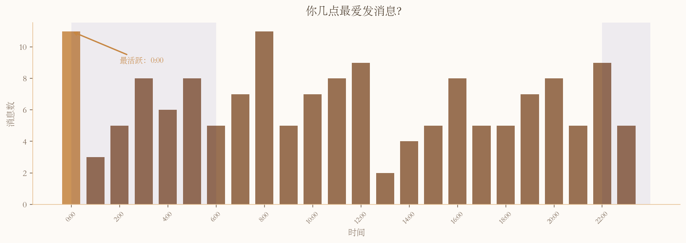
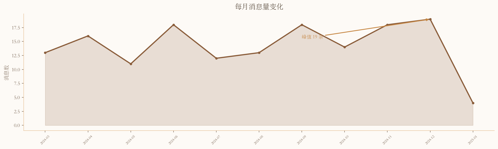

# ⬢ WeChat Persona

> 微信聊天记录人格分析工具 (Windows)：导出联系人/群聊消息，自动生成**聊天行为可视化 + Big5 (NEO-PI-R 30 facets) + MBTI 人格对比报告**。

本项目 fork 自 [姜饼探AI (ginger_wechat_portrait)](https://github.com/Jiang59991/ginger_wechat_portrait)，原作者为 **lewer (Jiang59991)**。原项目仅支持 macOS，本仓库在此基础上：

- 新增 **Windows 平台支持**（跨平台抽象层）
- 新增 **群聊分析**（多人画像对比）
- 扩展 Big5 至 **NEO-PI-R 30 facets**
- 重新设计报告主题（深绿 + 琥珀配色）

> macOS 用户请使用原项目：https://github.com/Jiang59991/ginger_wechat_portrait

## 效果预览

> 以下截图基于虚拟生成的 demo 数据，不含任何真实聊天记录。

<table>
<tr>
<td width="50%"></td>
<td width="50%"></td>
</tr>
<tr>
<td width="50%"></td>
<td width="50%"></td>
</tr>
</table>

---

## 使用要求

| 项目 | 要求 |
|------|------|
| 操作系统 | Windows 10/11 |
| 微信版本 | Windows 客户端 4.x（进程名 `Weixin.exe`） |
| Python | 3.10+ |
| 解密数据库 | 需自行准备（本工具不包含解密功能） |

---

## 安装

```bash
git clone https://github.com/Yugenee/wechat-persona.git
cd wechat-persona
pip install jieba wordcloud matplotlib anthropic pandas
```

> 中国大陆用户如果 pip 速度慢，加 `-i https://pypi.tuna.tsinghua.edu.cn/simple`

---

## 前置准备：解密数据库

WeChat for Windows 4.x 的本地数据库是 SQLCipher 4 加密的，本工具**不包含解密功能**，需要你自行解密。

推荐使用开源工具 [ylytdeng/wechat-decrypt](https://github.com/ylytdeng/wechat-decrypt)，具体步骤请参考该项目的文档。

解密完成后，在项目根目录创建 `config.json`：

```json
{
  "decrypted_db_dir": "C:/Users/你的用户名/Documents/wechat-decrypt/decrypted"
}
```

详细说明见 [安装指南_Windows.md](./安装指南_Windows.md)。

---

## 快速开始

### 一对一聊天分析

```bash
# 查看所有联系人
python export_contact.py --list-contacts

# 导出聊天记录
python export_contact.py --contact "联系人名字"

# 生成图表 + 人格分析输入
python main.py export_contact.csv

# AI 分析完成后，生成完整对比报告
python main.py export_contact.csv \
  --personality-result wechat_analysis_output/personality_result.json \
  --partner-personality-result wechat_analysis_output/partner_result.json \
  --partner-name "联系人名字"
```

### 群聊分析

```bash
# 查看所有群
python export_group.py --list-groups

# 导出群消息（按成员拆分，默认 top 4）
python export_group.py --group "群名片段" --top 4

# 为每位成员采样
python analyze_group_members.py group_<群名>/

# AI 分析完成后，生成群友画像报告
python group_report.py group_<群名>/
```

---

## 输出文件

```
wechat_analysis_output/
├── report.html              ← 完整 HTML 报告（浏览器打开）
├── report.css               ← 报告样式
├── personality_result.json  ← 自己的分析结果（含 30 facets）
├── partner_result.json      ← 对方的分析结果
└── charts/
    ├── hourly.png           ← 24 小时发消息分布
    ├── monthly_trend.png    ← 月度趋势
    ├── weekday_bar.png      ← 星期分布
    ├── word_cloud_pair.png  ← 双人高频词词云
    ├── length_dist.png      ← 消息长度分布
    └── radar.png            ← Big Five 雷达图
```

---

## 功能特性

- **Big5 + NEO-PI-R 30 facets**：每个大五维度拆解为 6 个子面，精细到想象/审美/感受/尝鲜/思想/价值观等
- **MBTI 推断**：作为辅助参考，标注置信度和场景局限性
- **群聊多人画像**：导出群消息按成员拆分，生成 N 连画像 HTML 报告
- **跨场景对比**：同一人在不同对话场景下的人格变化一目了然

---

## 隐私说明

- 所有数据处理在**本地**完成，不向任何外部服务发送消息内容
- 不会收集或上传任何数据
- **请勿用于分析他人设备上的数据**

---

## 致谢

本项目基于 [姜饼探AI (ginger_wechat_portrait)](https://github.com/Jiang59991/ginger_wechat_portrait) 开发，感谢原作者 **lewer** 的出色工作。

---

*Windows 10/11 · WeChat 4.x · Python 3.10+*
